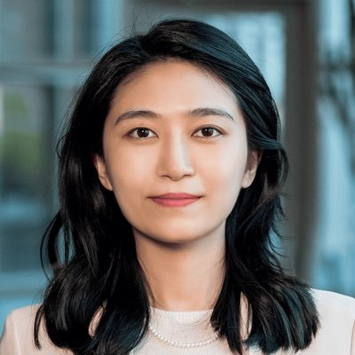

# 👥 Organizing Team

Meet the team behind the **Embodied Agent Interface Challenge @ NeurIPS 2025**. We are a diverse group of researchers from academia and industry working at the intersection of language, robotics, and embodied intelligence.

---

## 🧑‍💼 Lead Organizer

**Manling Li**  
*Assistant Professor*  
*Northwestern University*  
[Email](mailto:manling.li@northwestern.edu) • [Website](https://limanling.github.io/)

## 🧑‍💻 Co-Organizers

### Organizer 2

****  
**Name**  
*Title*  
*Institution*  
[Email](mailto:name@example.com) • [Website](https://your-website.com)

### Organizer 3

****  
**Name**  
*Title*  
*Institution*  
[Email](mailto:name@example.com) • [Website](https://your-website.com)

## 🧠 Advisory Committee

We are grateful to our advisory members for their guidance and support.

### Advisor 1  
*Name, Title, Affiliation*

### Advisor 2  
*Name, Title, Affiliation*

---

## 🤝 Affiliations
We thank the following institutions and organizations for their support:

  
  
  

*For any inquiries, please reach out to us at [TianweiBao@u.northwestern.edu](mailto:TianweiBao@u.northwestern.edu).*
