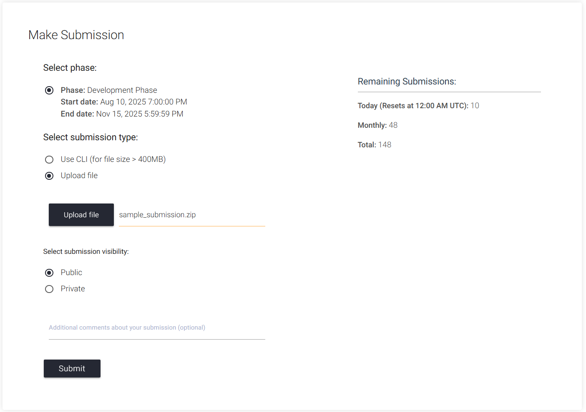

# 🏁 Participate in the Challenge

Thanks for your interest in the **Embodied Agent Interface Challenge**! 

Follow the instructions below to get started with the **Development Phase** of the EAI Challenge, and most importantly, have fun!

## 📚 Resources

To help you get up to speed and make the most of the **EAI Challenge**, we have prepared a set of essential resources. We recommend exploring them in the following order for the smoothest experience:

- **📝Tutorial**: [Step-by-step guide to setting up your environment and understanding the challenge](https://github.com/embodied-agent-interface/embodied-agent-interface)

- **📖Documentation**: [Complete reference for evaluating and troubleshooting four ability modules](https://embodied-agent-eval.readthedocs.io/)

- **🐳Docker Image**: [Prebuilt environment for running your experiments hassle-free](https://hub.docker.com/r/jameskrw/eai-eval)


## 📦 Submission Preparation

To make participation more accessible to the broader embodied AI community, we have designed a straightforward submission process. You are **not required** to set up or run the complex **BEHAVIOR** or **VirtualHome** simulation environments. All you need to provide is your model's outputs. We will take care of the rest and perform evaluation internally in a sandboxed environment within our infrastructure.

We have created a [**Starter Kit**](https://drive.google.com/file/d/1KGUIGetLaizLTzWqXdR8WlMTwKUpYJQa/view?usp=sharing) with all the essentials to help you get started quickly. The kit includes:

* **`llm_prompts/`**: A directory containing all the prompts you will use to query your model.
* **`sample_submission/`**: A sample submission folder that shows the required format and structure for your model's outputs.
* **`starter.ipynb`**: A notebook to guide you through the process of generating outputs and preparing your submission.

```
📁 Starter Kit Structure

eai_starter_kit/
├── llm_prompts/
│   ├── behavior_action_sequencing_prompts.json
│   ├── behavior_goal_interpretation_prompts.json
│   ├── behavior_subgoal_decomposition_prompts.json
│   ├── behavior_transition_modeling_prompts.json
│   ├── virtualhome_action_sequencing_prompts.json
│   ├── virtualhome_goal_interpretation_prompts.json
│   ├── virtualhome_subgoal_decomposition_prompts.json
│   └── virtualhome_transition_modeling_prompts.json
├── sample_submission/
│   ├── behavior_action_sequencing_outputs.json
│   ├── behavior_goal_interpretation_outputs.json
│   ├── behavior_subgoal_decomposition_outputs.json
│   ├── behavior_transition_modeling_outputs.json
│   ├── virtualhome_action_sequencing_outputs.json
│   ├── virtualhome_goal_interpretation_outputs.json
│   ├── virtualhome_subgoal_decomposition_outputs.json
│   └── virtualhome_transition_modeling_outputs.json
└── starter.ipynb
```

## 📤 EvalAI Submission

To submit your model's outputs for evaluation, please follow these steps:

1. **Review the [EvalAI documentation](https://evalai.readthedocs.io/en/latest/participate.html)**: Familiarize yourself with the submission process and officially join the [EAI Challenge](https://eval.ai/web/challenges/challenge-page/2621/overview). While at the same time, please fill out the [Participant Information Form](https://forms.gle/vEJ4jeuE3GfVGaGBA) to help us better organize the competition.

2. **Prepare Your Submission**: Organize your model's outputs according to the structure outlined in the sample_submission in the [**Starter Kit**](https://drive.google.com/file/d/1KGUIGetLaizLTzWqXdR8WlMTwKUpYJQa/view?usp=sharing). Please make sure names of 8 required output files exactly match the expected names as shown in the sample_submission.

3. **Upload to EvalAI**: Use the EvalAI platform to upload your submission. Please zip your submission folder before uploading. The zipped folder should contain all required output files in the correct structure as shown below.

    ```
    sample_submission.zip/
    ├── behavior_action_sequencing_outputs.json
    ├── behavior_goal_interpretation_outputs.json
    ├── behavior_subgoal_decomposition_outputs.json
    ├── behavior_transition_modeling_outputs.json
    ├── virtualhome_action_sequencing_outputs.json
    ├── virtualhome_goal_interpretation_outputs.json
    ├── virtualhome_subgoal_decomposition_outputs.json
    └── virtualhome_transition_modeling_outputs.json
    ```

    For Mac users, you can use the following command in the terminal to zip your submission folder without including unnecessary hidden files like `.DS_Store` or `__MACOSX`:
    ```
    zip -r sample_submission.zip sample_submission -x "*.DS_Store" -x "__MACOSX/*"
    ```
    A sample submission should look like this:
    
    
4. **Monitor Your Submission**: After submitting, you can monitor the submission status on [My Submissions](https://eval.ai/web/challenges/challenge-page/2621/my-submission) page and performance of your submission on the [Leaderboard](https://eval.ai/web/challenges/challenge-page/2621/leaderboard). Please note that because the evaluation involves interacting with the simulation environments, it may take 10–30 minutes to receive your results.


We look forward to seeing your innovative solutions in action! If you have any questions or need assistance, don't hesitate to reach out to us at `TianweiBao@u.northwestern.edu` or post in our [Slack](https://join.slack.com/t/eaichallengen-xzk8506/shared_invite/zt-3cm0dms1t-tvylNsamaZQgC03k0kBB9g).
